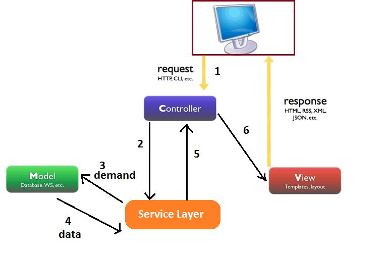
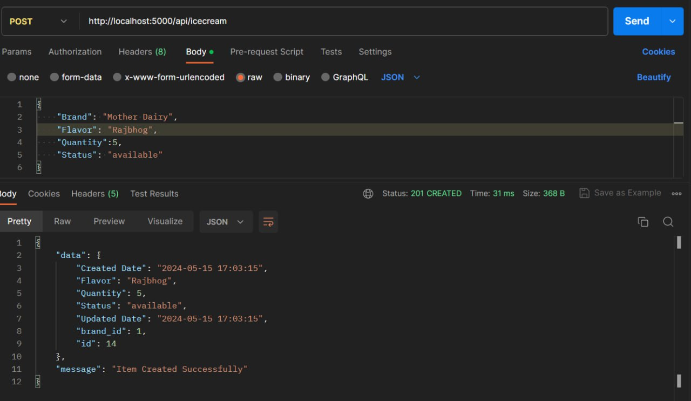
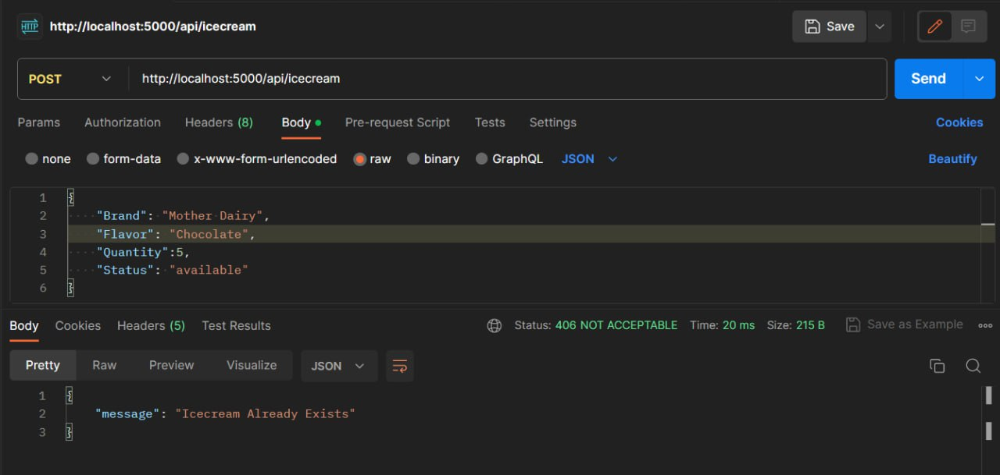
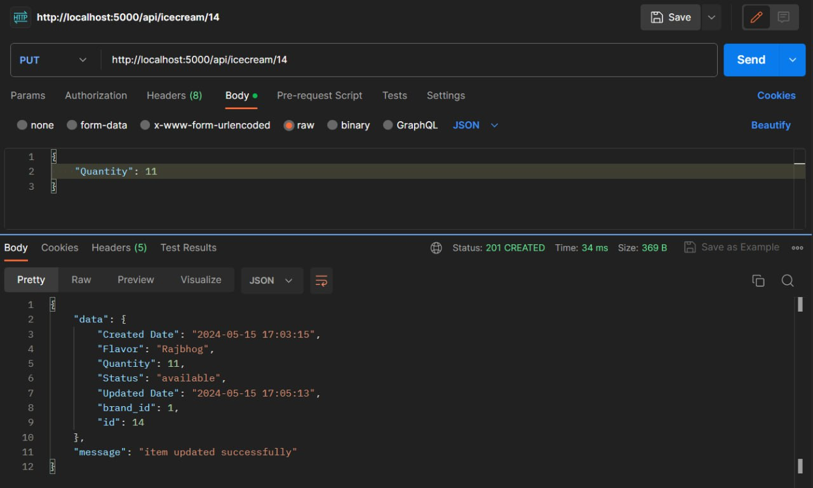
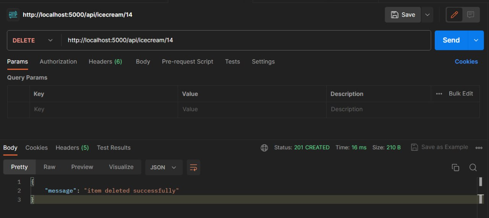
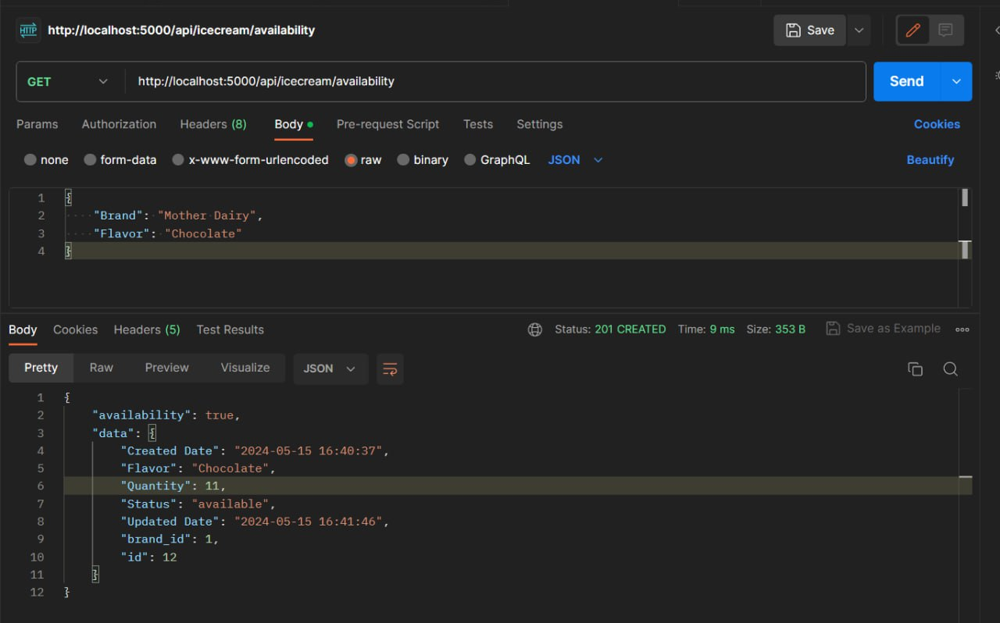

# IceCream Parlor

A backend application for performing CRUD (create, read, update, delete) operations using Flask and Python.

## Requirements

#### API Endpoints

##### 1. Create a New Item

- Endpoint: /api/icecream
- Method: POST
- Request Body Parameters:
  - Brand (string, required): The brand of the ice cream.
  - Flavor (string, required): The flavor of the ice cream.
  - Quantity (integer, required): The quantity of the ice cream.
  - Status (string, optional, default: "available"): The status of the ice cream.
- Response: Returns the details of the newly created item.

##### 2. Update the Quantity of an Item

- Endpoint: /api/icecream/:id
- Method: PUT
- Path Parameter:
  - id (string, required): The ID of the item to update.
- Request Body Parameters:
  - Quantity (integer, required): The new quantity of the ice cream.
- Response: Returns the updated item details.

##### 3. Delete an Item

- Endpoint: /api/icecream/:id
- Method: DELETE
- Path Parameter:
  - id (string, required): The ID of the item to delete.
- Response: Returns a success message.

##### 4. Check Availability

- Endpoint: /api/icecream/availability
- Method: GET
- Query Parameters:
  - Brand (string, required): The brand of the ice cream to check.
  - Flavor (string, required): The flavor of the ice cream to check.
- Response: Returns the availability status of the specified ice cream.

## Installation

1. Create a project folder and a .venv folder within:

    bash
    mkdir IceCream_Parlor
    cd IceCream_Parlor
    py -3 -m venv .venv
    

2. Activate the virtual environment:

    bash
    .venv\Scripts\activate
    

3. Install the required packages:

    bash
    pip install Flask
    pip install mysql-connector-python
    

4. Run the database_schema.sql file:

    bash
    mysql --user="username" --database="icecream_parlor" --password="yourpassword" < "./database_schema.sql"
    

## Dataflow

Dataflow between controller, service, model, and database:

1. Send request to the controller.
2. Controller calls service layer methods.
3. Service layer requests data from the model.
4. Model sends requested data (d1) to the service layer.
5. After processing, service layer returns generated data (d2) to the controller.
6. Controller sends data (d2) to the view.

### Routes

- Function: Routes define the URL paths that trigger specific functions within your application.
- Example: A route defined as /users/<username> maps to a function that handles requests for user profiles based on the provided username.
- Benefits: Routes provide a clear way to map user actions (URL requests) to corresponding functionalities in your code, promoting a clean separation of concerns between handling URLs and the underlying application logic.

### Postman req-res 

"# icecream_parlor" 
